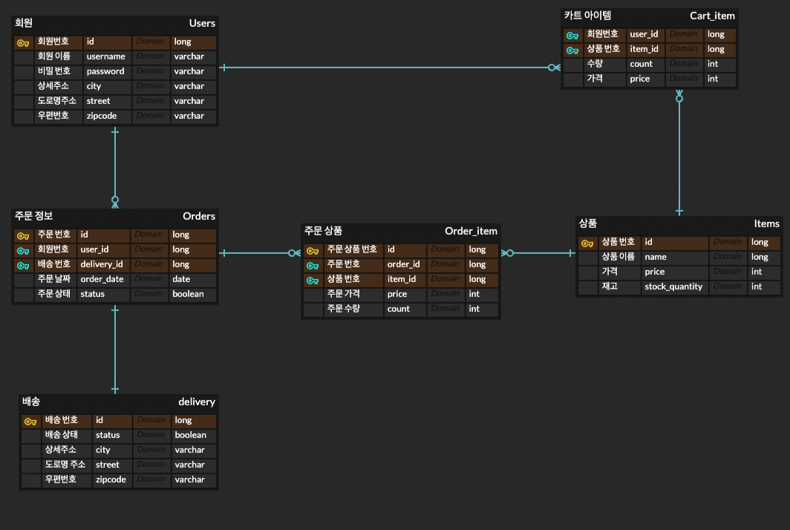

# ShoppingCart

Projects just for understanding below topics.

## To Do

### API

- [x] API 설계 
  
  [API 설계 문서](files/API_V1_SPEC.pdf)
- [x] ERD 정의 
      

- [x] Users
  - [x] Modeling
  - [x] Login
  - [x] Sign Up
  - [x] See Profile
  - [x] Edit Profile

- [x] Item
  - [x] Modeling
  - [x] Add Item
  - [x] Get Item Information
  - [x] Get Items List
    - [x] Pagination
  - [x] Delete Item
  - [x] Edit Item

- [x] Orders
  - [x] Modeling
  - [x] See Orders
  - [x] New Order
  - [x] Cancel Order

- [x] Cart
  - [x] Modeling
  - [x] See Cart
  - [x] Add item in Cart
  - [x] Modify item in Cart
  - [x] Delete item in Cart

- [x] Delivery
  - [x] Modeling
  - [x] See deliveries
  - [x] New delivery
  - [x] Change delivery status

## Auth

- [x] 인증 방식
  - [x] JWT를 이용한 구현
    - [x] Access Token
    - [x] Refresh Token

## Test
- [ ] 테스트 라이브러리 선택
- [ ] Users Tests
- [ ] Item Test
- [ ] Orders Test
- [ ] Cart Test
- [ ] Delivery Test

## CI / CD
- [ ] Jenkins를 쓸지 Github Action을 사용 할 지 정하기
- [x] Docker 파일 구성

## New Feature
- [ ] 실시간 상담 기능 ( socket )
- [ ] CDN
- [x] S3 Upload
- [x] 로드밸런싱
  - [x] [pm2](files/pm2.md)
- [x] Redis Caching
  
### Front
- 기능만 가능하게 아주 간단히 구현하자
